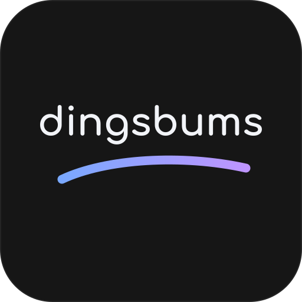
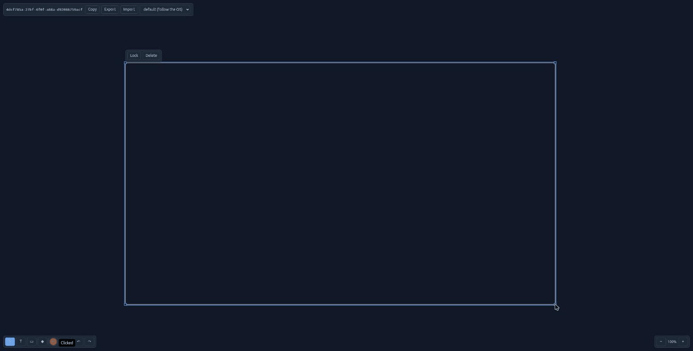

  

<h1 align="center">dingsbums</h1>

  A digital collaboration whiteboard: open a session, share its link, and draw
  together in real time.

  <a href="#features">Features</a>
  &nbsp;·&nbsp;
  <a href="#installation">Installation</a>
  &nbsp;·&nbsp;
  <a href="docs/superpowers/specs/2026-10-06-whiteboard-design.md">Design</a>
  &nbsp;·&nbsp;
  <a href="#tools-used">Tools used</a>

---

No accounts, no setup: create a session and send the link (`/#<session-id>`)
to whoever should join. Everyone on it edits the same board live.

## Why the name

*Dingsbums* is German for "thingamajig": the word for a thing whose name you
can't think of right now. That's what a whiteboard is full of.

## Features

- Frames, sticky notes, text, shapes (circle, rectangle, star, arrow) and
  connections between them.
- Fill colours, groups, locking, undo/redo.
- Paste images and text straight onto the board.
- An infinite canvas: scroll to pan (shift + wheel sideways), ctrl + wheel or
  the + and − buttons to zoom.
- Export a board as a `.tar` and import it again.
- Twelve colour themes, or follow the OS light/dark setting.

Sessions live in the server's memory. A session nobody has open for 15
minutes is gone, so export what you want to keep.

## Installation

Needs [babashka](https://github.com/babashka/babashka#installation), Node.js
with npm, and a JDK 25 or newer (for the frontend build).

    git clone https://github.com/sstoehrm/dingsbums.git
    cd dingsbums
    npm install
    bb build          # frontend release build into public/js
    bb server         # http://localhost:8080 (bb server <port> for another)

Development: `bb server` plus `npx shadow-cljs watch app` (hot reload; bb
serves public/).

Tests:

    bb test           # backend
    npm test          # frontend

## License

MIT, see [LICENSE](LICENSE). Third-party palettes:
[THIRD-PARTY-NOTICES.md](THIRD-PARTY-NOTICES.md).

## Tools used

- [babashka](https://babashka.org) with its built-in
  [http-kit](https://github.com/http-kit/http-kit): the backend.
- [ClojureScript](https://clojurescript.org) and
  [shadow-cljs](https://github.com/thheller/shadow-cljs): the frontend build.
- [hammer](https://github.com/sstoehrm/hammer): UI library (events, components,
  the Canvas 2D board, WebSocket tubes).
- [simpleviz](https://github.com/sstoehrm/simpleviz): the colour themes.
- [Claude Code](https://claude.com/claude-code) with
  [superpowers](https://github.com/obra/superpowers): built with.
